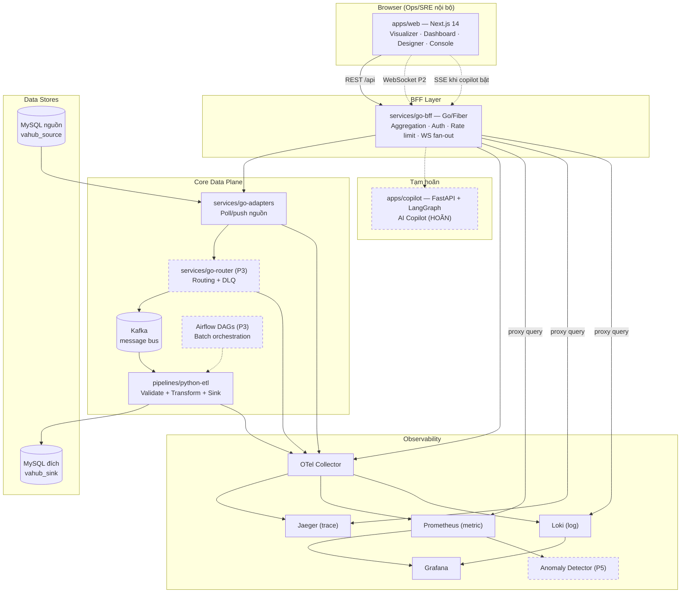
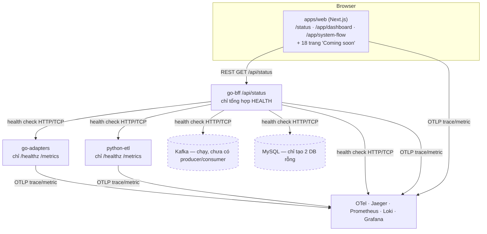
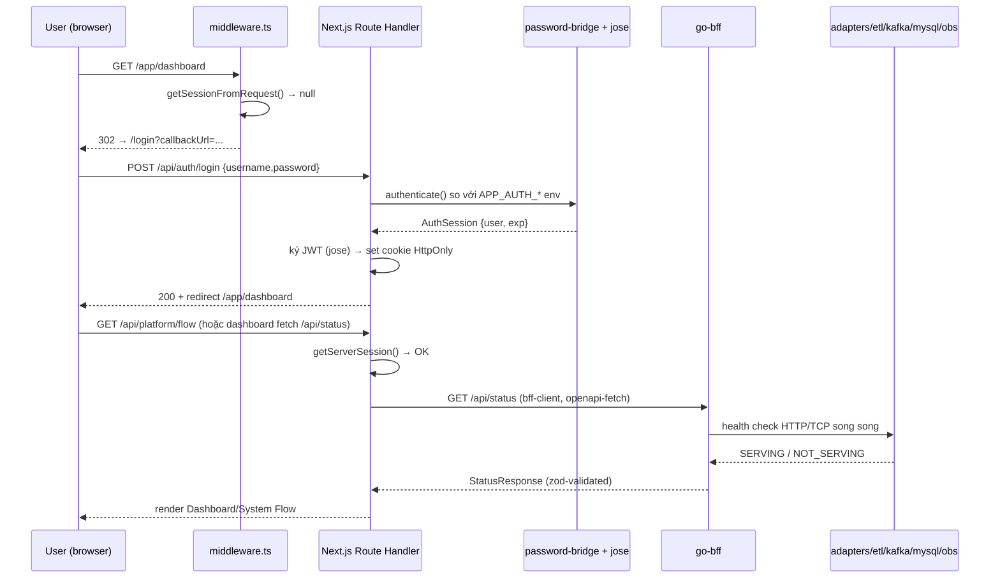
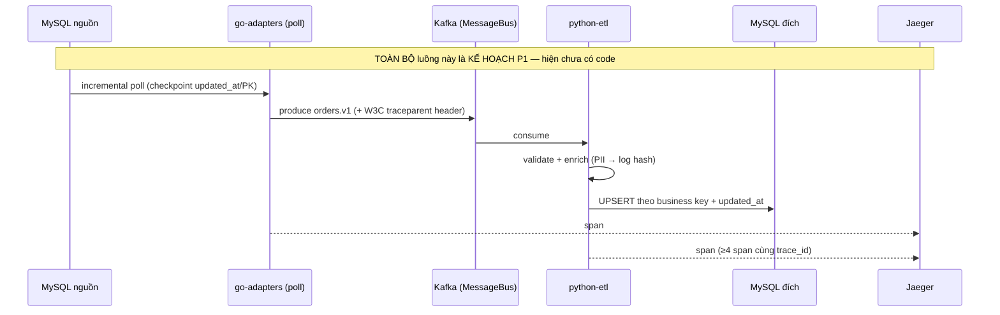
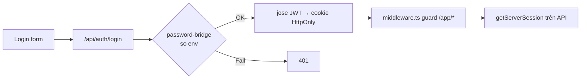
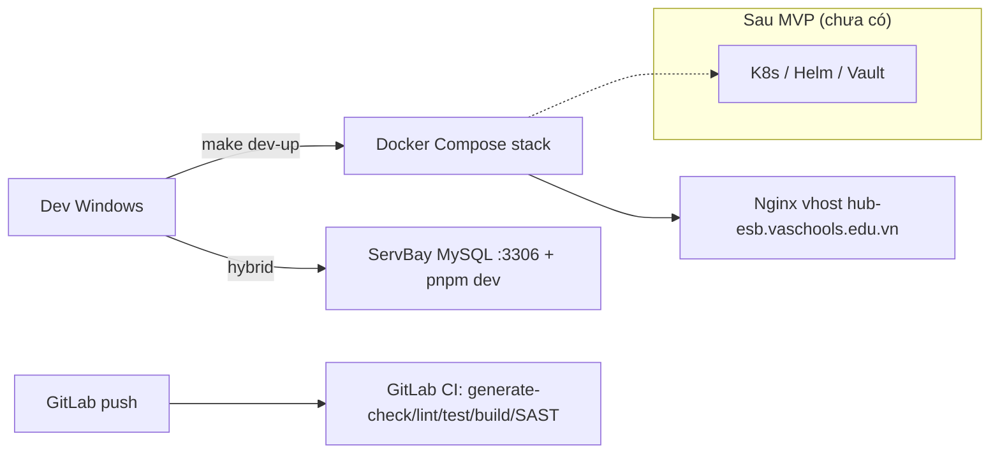
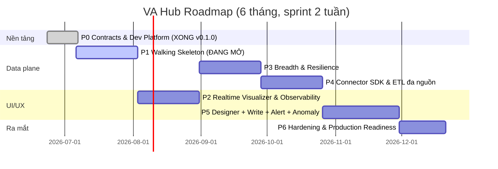

# VA Hub — Tài liệu Kiến trúc Tổng thể (Big Picture)

> Tài liệu này được xây dựng bằng cách **đọc trực tiếp source code + config + CI + docs** trong repo `va-hub`, đối chiếu code thực tế với tài liệu. Mọi kết luận đều kèm file/thư mục làm căn cứ. Khi tài liệu lệch code, ưu tiên **code** và ghi rõ.
>
> **Ngày lập:** 2026-07-06 · **Trạng thái repo tại thời điểm đọc:** Phase 0 đóng (`v0.1.0`), Phase 1 đang mở.

## Mục lục

1. [Executive Summary](#phần-1--executive-summary)
2. [Big Picture (sơ đồ kiến trúc)](#phần-2--big-picture)
3. [Công nghệ đang sử dụng](#phần-3--công-nghệ-đang-sử-dụng)
4. [Kiến trúc Source Code](#phần-4--kiến-trúc-source-code)
5. [Các Module nghiệp vụ](#phần-5--các-module-nghiệp-vụ)
6. [Luồng hoạt động](#phần-6--luồng-hoạt-động)
7. [Database](#phần-7--database)
8. [API](#phần-8--api)
9. [Frontend](#phần-9--frontend)
10. [Authentication & Authorization](#phần-10--authentication--authorization)
11. [Tích hợp](#phần-11--tích-hợp)
12. [Deployment](#phần-12--deployment)
13. [Tiến độ hiện tại](#phần-13--tiến-độ-hiện-tại)
14. [Roadmap](#phần-14--roadmap)
15. [Chất lượng hệ thống](#phần-15--chất-lượng-hệ-thống)
16. [Rủi ro](#phần-16--rủi-ro)
17. [Khuyến nghị](#phần-17--khuyến-nghị)
18. [Bức tranh tổng thể + Chấm điểm](#phần-18--bức-tranh-tổng-thể)

---

## PHẦN 1 — Executive Summary

**VA Hub là một nền tảng tích hợp dữ liệu (ESB / Middleware Hub / Data Pipeline) kèm tầng trực quan hóa cho hệ thống trường học VA Schools.** Căn cứ: `README.md`, `docs/ARCHITECTURE.md`, `docs/BRIEF-v2.md`.

**Đây là dự án gì?** Một tổ chức giáo dục có nhiều hệ thống rời rạc: hệ quản lý học sinh (SIS), phần mềm kế toán/nhân sự, file Excel nhập tay, các API khác nhau. Dữ liệu nằm rải rác và không "nói chuyện" được với nhau. VA Hub đóng vai trò **trạm trung chuyển trung tâm**: hút dữ liệu từ nhiều nguồn, làm sạch/biến đổi (ETL), rồi đẩy sang các hệ đích — đồng thời cho đội CNTT một **màn hình theo dõi trực quan** để thấy dữ liệu đang chảy qua các "đường ống" (pipeline) như thế nào theo thời gian thực.

**Tại sao cần tồn tại / bài toán doanh nghiệp:** Tổ chức đang có dữ liệu PII (học sinh, phụ huynh, nhân sự) phân mảnh, tích hợp thủ công dễ sai và không truy vết được. VA Hub giải quyết: (1) tích hợp & đồng bộ đa nguồn tự động, (2) giám sát/truy vết xuyên suốt, (3) phát hiện bất thường, (4) quản trị pipeline qua giao diện thay vì sửa file cấu hình tay. Căn cứ: `docs/BRIEF-v2.md` mục 1, `docs/DELIVERY-PLAN.md` mục 7 câu 1–2, 6.

**Điểm khác biệt:** Không chỉ là ETL "chạy ngầm" — VA Hub bổ sung **Web UI trực quan hóa topology dạng DAG động, animation dòng chảy dữ liệu real-time**, và (dài hạn) một **AI Copilot** để hỏi đáp vận hành. Kiến trúc **polyglot** (Go cho data plane, Python cho ETL/ML, TypeScript cho UI) với **contract-first codegen** đảm bảo 3 ngôn ngữ luôn đồng bộ hợp đồng dữ liệu.

**Giá trị mang lại:** Giảm thời gian thêm một nguồn dữ liệu mới xuống ≤ 3 người-ngày (mục tiêu Phase 4), truy vết sự cố nhanh, tuân thủ Nghị định 13/2023 về dữ liệu cá nhân, và nền tảng vận hành tự phục vụ cho đội CNTT nhỏ.

**Người dùng chính:** Đội CNTT / Ops nội bộ (~5 người). UI desktop-first (≥1280px), không tối ưu mobile. Căn cứ: `docs/ARCHITECTURE.md` (bảng giả định), `docs/DELIVERY-PLAN.md` mục 7 câu 8.

**Quy mô hệ thống (mục tiêu MVP):** ≤ 500 node/topology; 50–200 msg/s peak (message 5–20KB); 20–50 pipeline trong năm đầu; load test bắt buộc 100 WS client + 500 msg/s. Căn cứ: `docs/DELIVERY-PLAN.md` mục 0.3, mục 7 câu 3/11.

> ⚠️ **Hiện trạng quan trọng (đối chiếu code):** Dự án **mới đóng Phase 0 (`v0.1.0`, 2026-07-06)** và đang mở Phase 1. Phần lớn tính năng nghiệp vụ ở trên **hiện là kế hoạch/khung xương (skeleton)**, chưa phải chức năng chạy thật. Chi tiết ở [Phần 13](#phần-13--tiến-độ-hiện-tại).

---

## PHẦN 2 — Big Picture

### 2.1 Kiến trúc mục tiêu (theo thiết kế — brief + ADR)



### 2.2 Kiến trúc THỰC TẾ đang chạy (Phase 0 — đối chiếu code)



### Vai trò từng thành phần

| Thành phần | Vai trò | Trạng thái thực tế |
|---|---|---|
| **Web UI** (`apps/web`) | Console vận hành, visualizer, dashboard | Khung shell + 2 trang thật + 18 trang placeholder |
| **BFF** (`services/go-bff`) | Cổng duy nhất browser gọi; aggregate/authz/rate-limit; sau này WS fan-out + proxy Prom/Jaeger/Loki | Chỉ có `/api/status` (health aggregator), `/healthz`, `/readyz`, `/metrics` |
| **Adapters** (`services/go-adapters`) | Kết nối & poll hệ nguồn/đích | Skeleton — chỉ health/metrics, **chưa đọc MySQL** |
| **Router** (`services/go-router`) | Định tuyến message + DLQ | **Chỉ README** (P3) |
| **Python ETL** (`pipelines/python-etl`) | Validate + transform + UPSERT sink | Skeleton FastAPI — **chưa consume Kafka** |
| **Kafka** | Message bus (qua interface `MessageBus`, ADR-002) | Container chạy; **impl bus là stub** (`shared/bus/go/kafka/stub.go`) |
| **MySQL** | DB chính: nguồn + đích | 2 database rỗng (`vahub_source`, `vahub_sink`), **0 bảng** |
| **Observability** | Trace/metric/log/dashboard | OTel Collector + Jaeger + Prometheus + Loki + Grafana đều chạy trong compose |
| **Anomaly Detector** | ML phát hiện bất thường | **Chỉ README** (P5) |
| **AI Copilot** (`apps/copilot`) | LLM vận hành | **Chỉ README — tạm hoãn** |

---

## PHẦN 3 — Công nghệ đang sử dụng

Bảng đọc trực tiếp từ `apps/web/package.json`, `services/go-bff/go.mod`, `pipelines/python-etl`, `infra/compose/docker-compose.yml`, `.gitlab-ci.yml`. Mục nào chưa có dependency thật được đánh dấu rõ.

| Thành phần | Công nghệ | Mục đích | Bằng chứng |
|---|---|---|---|
| Monorepo | pnpm 10.15 workspace + Turborepo 2.5 | Quản lý JS/TS | `package.json`, `pnpm-workspace.yaml`, `turbo.json` |
| Go workspace | `go.work` (Go 1.25) | Đa module Go | `go.work` |
| Frontend framework | Next.js 14.2 (App Router) + React 18.3 | Web UI/SSR | `apps/web/package.json` |
| Ngôn ngữ FE | TypeScript 5.6 (strict) | Type safety | `apps/web/tsconfig.json` |
| Styling | Tailwind CSS 3.4 + design tokens CSS | UI | `apps/web/package.json`, `packages/ui/src/tokens.css` |
| UI primitives | (shadcn/ui theo brief) + `packages/ui` nội bộ | Component chung | `packages/ui` (đang tối giản, chưa có Radix trong deps) |
| Icon | `lucide-react` | Icon | `apps/web/package.json` |
| Node graph | `@xyflow/react` 12 (React Flow) | Visualizer DAG | `apps/web/package.json` |
| Animation | `framer-motion` 12 | Motion | `apps/web/package.json` |
| State (server) | TanStack Query 5 | Server state | `hooks/use-platform-queries.ts` |
| State (UI) | Zustand 5 | UI state | `stores/ui-preferences.ts` |
| Form | react-hook-form 7 + `@hookform/resolvers` | Form | `apps/web/package.json` |
| Validation | Zod 3 (nguồn contract) | Runtime validation + schema | `packages/schemas/src/status.ts` |
| i18n | next-intl 3 (tiếng Việt mặc định) | Đa ngôn ngữ | `apps/web/src/messages/vi.json` |
| Auth (FE) | `jose` (JWT ký/verify) + cookie session | Session | `lib/auth/session-token.ts`, `password-bridge.ts` |
| Backend BFF | Go 1.25 + Fiber v2.52 | HTTP API/BFF | `services/go-bff/go.mod`, `internal/httpserver/server.go` |
| Backend adapters | Go 1.25 + net/http chuẩn | Adapter | `services/go-adapters/internal/httpserver/server.go` |
| Backend ETL | Python 3.12 + FastAPI + Starlette | ETL service | `pipelines/python-etl/app/main.py` |
| ORM | **Chưa có** (chưa truy cập DB) | — | không có driver DB trong go.mod/etl |
| Queue/Bus | Apache Kafka 3.8, interface `MessageBus` | Message bus | `docker-compose.yml`, `shared/bus/`, ADR-002 |
| Cache | **Chưa có** (Redis = "nợ điều kiện" WS backplane P6) | — | `DELIVERY-PLAN.md` §2 P2 |
| Storage | MySQL 8.4 | DB nguồn/đích | `docker-compose.yml`, `infra/mysql/init/` |
| Logging | slog (Go, `shared/go-kit/logging`), logging_setup (Py), logger.ts (Web) — JSON `service`/`severity`/`trace_id` | Structured log | `shared/go-kit/logging/logging.go`, `apps/web/src/lib/logger.ts` |
| Tracing | OpenTelemetry SDK (Go/Py/otelfiber) → OTel Collector 0.112 → Jaeger 1.62 | Distributed trace | `go.mod`, `telemetry.py`, `docker-compose.yml` |
| Metrics | Prometheus 2.55 + `prom-client` (web) + `promhttp` (Go) + `prometheus_client` (Py) | Metric | `docker-compose.yml`, các `/metrics` |
| Log store | Grafana Loki 3.2 | Log aggregation | `docker-compose.yml` |
| Dashboard | Grafana 11.3 | Visualization ops | `docker-compose.yml` |
| Build tool | Turborepo (JS), `go build`, Docker multi-stage | Build | `turbo.json`, các `Dockerfile` |
| Deployment | Docker Compose + ServBay (MVP) | Runtime | `infra/compose/`, `infra/servbay/`, `docs/SERVBAY.md` |
| CI/CD | GitLab CI (generate-check→lint→test→build) + SAST + Secret Detection | Pipeline | `.gitlab-ci.yml` |
| API | REST (OpenAPI spec-first) + WebSocket (P2) — **không GraphQL** | Web API | ADR-004, `packages/schemas/openapi` |
| WebSocket | Native WS (kế hoạch P2) | Real-time | ADR-004 (chưa code) |
| RPC nội service | Protobuf (buf) + gRPC types | Contract Go/Python | `shared/proto/`, ADR-002/003 |
| Email/Alert | Email/Zalo (kế hoạch P3) | Alerting | `DELIVERY-PLAN.md` mục 7 câu 8 (**chưa code**) |
| Search | **Không có** | — | — |
| AI/LLM | Anthropic API + LangGraph (**tạm hoãn**) | Copilot | `apps/copilot/README.md`, DELIVERY-PLAN §8 |
| Testing | Vitest (TS), `go test`, pytest; Playwright (E2E, kế hoạch) | Test | `vitest.config.ts`, `*_test.go`, `tests/test_health.py` |
| Codegen | buf (proto→Go/Py), zod→JSON Schema→OpenAPI→TS/Go | Contract pipeline | `scripts/make/codegen.mk`, `packages/schemas/scripts/` |
| OpenAPI | `bff.v1.yaml` sinh từ zod → `sdk-ts` + `types.gen.go` | API contract | `packages/schemas/scripts/generate-bff-openapi.ts` |
| Docs | Markdown (`docs/`), ADR | Tài liệu | `docs/*.md`, `docs/adr/` |

**Khác biệt code vs docs cần lưu ý:**
- Brief nêu shadcn/ui (Radix), NextAuth, socket.io, Recharts, react-grid-layout, TanStack Table, Sentry — **chưa có** trong `apps/web/package.json`. Đây là công nghệ **kế hoạch cho P2+**.
- Auth **không dùng NextAuth/Keycloak** như brief; hiện là password-bridge tự viết + JWT `jose` (`docs/MOCKS.md` xác nhận).

---

## PHẦN 4 — Kiến trúc Source Code

```text
va-hub/
├─ apps/
│  ├─ web/            Next.js console (App Router)
│  └─ copilot/        [README-only] AI Copilot — HOÃN
├─ services/
│  ├─ go-bff/         BFF Go/Fiber — /api/status aggregator
│  ├─ go-adapters/    Adapter Go — skeleton health/metrics
│  └─ go-router/      [README-only] Router — P3
├─ pipelines/
│  └─ python-etl/     FastAPI ETL — skeleton health/metrics
├─ packages/
│  ├─ ui/             React components + design tokens
│  ├─ schemas/        zod (nguồn) → JSON Schema + OpenAPI
│  └─ sdk-ts/         TS client BFF (sinh từ OpenAPI)
├─ shared/
│  ├─ proto/          Protobuf + gen Go/Python
│  ├─ go-kit/         Lib Go chung: logging, telemetry
│  └─ bus/            MessageBus interface (Kafka impl = stub)
├─ infra/
│  ├─ compose/        Docker Compose dev stack
│  ├─ observability/  OTel, Prometheus, Loki, Grafana config
│  ├─ orchestration/  [README-only] airflow-dags — P3
│  ├─ mysql/init/     SQL tạo DB nguồn/đích
│  ├─ servbay/        Nginx vhost ServBay
│  └─ deploy/         [placeholder] K8s/Helm sau MVP
├─ configs/           env.example, golangci.yml
├─ scripts/           PowerShell/shell + make/*.mk
└─ docs/              ARCHITECTURE, BRIEF, DELIVERY-PLAN, ADR, MOCKS...
```

### Trách nhiệm từng thư mục & khái niệm kiến trúc

**Frontend (`apps/web/src/`):**
- `app/` — **Pages/Routes** (App Router): `(marketing)` landing, `login`, `status` (slice P0 thật), `app/app/*` (console 20 trang + layout), `app/api/*` (Route Handlers nội bộ).
- `components/` — `app/` (shell, sidebar, header, dashboard-view), `system-flow/` (canvas React Flow, node, panel), `platform/`, `auth/`, `ui/`.
- `hooks/` — `use-platform-queries.ts` (TanStack Query), `use-motion-safe.ts`.
- `stores/` — Zustand `ui-preferences.ts`.
- `lib/` — `api/` (bff-client, platform-api, route-logging), `auth/` (session, provider, password-bridge), `logger.ts`, `metrics.ts`.
- `config/` — `app-navigation.ts`, `system-flow.ts` (topology layout tĩnh).
- `i18n/`, `messages/` — next-intl (`vi.json`).
- `middleware.ts` — chặn `/app/*` nếu chưa đăng nhập.

**Backend Go (`services/*`, `shared/go-kit`):**
- `main.go` — entrypoint: load config → logger → telemetry → HTTP server → graceful shutdown.
- `internal/config/` — Config (env-based, 12-factor).
- `internal/httpserver/` — Controller/Handler + middleware (access log, otel).
- `internal/status/` — Service aggregator health (BFF).
- `internal/api/types.gen.go` — types sinh từ OpenAPI (không sửa tay).
- `shared/go-kit/{logging,telemetry}` — Provider/lib chung.

**Backend Python (`pipelines/python-etl/app/`):**
- `main.py` — FastAPI app + lifespan + instrument.
- `config.py` — settings.
- `routes/health.py` — Controller health.
- `logging_setup.py`, `telemetry.py` — logging/tracing.

**Contracts (`shared/proto`, `packages/schemas`):**
- `shared/proto/*.proto` → `gen/go`, `gen/python`.
- `packages/schemas/src/*.ts` (zod) → `json-schema/`, `openapi/bff.v1.yaml` → `sdk-ts` + Go types.

**Chưa tồn tại (khái niệm trong đề bài):** `migration`, `seed`, `job`, `event/listener` runtime, `worker`, `scheduler`, `command/CLI` nghiệp vụ — thuộc P1–P5.

---

## PHẦN 5 — Các Module nghiệp vụ

Danh sách từ điều hướng console (`apps/web/src/config/app-navigation.ts`, 20 mục / 5 nhóm), đối chiếu code từng trang. % hoàn thành theo bằng chứng code.

| # | Module | Nhóm | Mục đích | % hoàn thành | Bằng chứng |
|---|---|---|---|---|---|
| 1 | **Status (public)** | — | Health toàn stack qua BFF | **~90%** (slice P0 thật) | `app/status/page.tsx` + `go-bff/internal/status` |
| 2 | **Dashboard** | overview | Tổng quan health + quick links | **~60%** (chỉ health thật) | `components/app/dashboard-view.tsx` |
| 3 | **System Flow** | overview | Topology DAG (health-driven) | **~40%** (node/edge tĩnh + health; metric = `pending`) | `system-flow.server.ts`, `config/system-flow.ts` |
| 4 | **Pipelines** | integration | Quản lý pipeline | **~5%** Coming soon | `app/app/pipelines/page.tsx` |
| 5 | **Source Connectors** | integration | Cấu hình nguồn | **~5%** Coming soon | `connectors/sources/page.tsx` |
| 6 | **Destination Connectors** | integration | Cấu hình đích | **~5%** Coming soon | `connectors/destinations/page.tsx` |
| 7 | **Workflow** | integration | Điều phối luồng | **~5%** Coming soon | `workflow/page.tsx` |
| 8 | **Metadata** | integration | Danh mục metadata | **~5%** Coming soon | `metadata/page.tsx` |
| 9 | **Mapping** | integration | ETL mapping khai báo | **~5%** Coming soon | `mapping/page.tsx` |
| 10 | **Scheduler** | operations | Lịch batch | **~5%** Coming soon | `scheduler/page.tsx` |
| 11 | **ETL Jobs** | operations | Theo dõi job | **~5%** Coming soon | `etl-jobs/page.tsx` |
| 12 | **Monitoring** | operations | Giám sát | **~5%** Coming soon | `monitoring/page.tsx` |
| 13 | **Logs** | operations | Log tail (Loki) | **~5%** Coming soon | `logs/page.tsx` |
| 14 | **Metrics** | operations | Chart Prometheus | **~5%** Coming soon | `metrics/page.tsx` |
| 15 | **Alerts** | operations | Alert rule + kênh | **~5%** Coming soon | `alerts/page.tsx` |
| 16 | **Users** | administration | Quản lý user | **~5%** Coming soon | `users/page.tsx` |
| 17 | **Roles** | administration | RBAC | **~5%** Coming soon | `roles/page.tsx` |
| 18 | **Settings** | administration | Cấu hình | **~5%** Coming soon | `settings/page.tsx` |
| 19 | **Audit Logs** | administration | Nhật ký hành động ghi | **~5%** Coming soon | `audit-logs/page.tsx` |
| 20 | **API Explorer** | developer | Khám phá API | **~5%** Coming soon | `api-explorer/page.tsx` |
| 21 | **Documentation** | developer | Tài liệu | **~5%** Coming soon | `documentation/page.tsx` |
| — | **Authentication** | (cross) | Đăng nhập/session | **~50%** (password-bridge + JWT, chưa OIDC/RBAC) | `lib/auth/*`, `api/auth/*` |
| — | **AI Copilot** | (deferred) | LLM vận hành | **0%** (README) | `apps/copilot/README.md` |

**Tổng kết:** 18/20 trang console là **placeholder "Coming soon"** (dùng chung `renderComingSoonPage` / `ComingSoonPage`). Chỉ Dashboard + System Flow có logic thật, và cả hai **chỉ tiêu thụ dữ liệu health** từ `/api/status`. Mọi module Pipeline/Connector/Mapping/RBAC/Audit… **chưa có backend, chưa có bảng DB, chưa có API** — đúng trạng thái Phase 0.

---

## PHẦN 6 — Luồng hoạt động

### 6.1 Luồng THỰC TẾ đang chạy: Login + xem Status



Căn cứ: `middleware.ts`, `api/auth/login/route.ts`, `lib/auth/session.ts`, `lib/bff-client.ts`, `go-bff/internal/httpserver/server.go`, `go-bff/internal/status/status.go`.

### 6.2 Luồng MỤC TIÊU (Phase 1 walking skeleton — chưa code)



Căn cứ: `docs/DELIVERY-PLAN.md` §2 Phase 1, `docs/MOCKS.md` (bus/adapters/etl đều là stub). Notification/Queue-worker/AI/Background-job **chưa tồn tại**.

---

## PHẦN 7 — Database

**Đọc migration & schema thực tế:** `infra/mysql/init/001-create-databases.sql` + `infra/mysql/init/README.md`.

```sql
CREATE DATABASE IF NOT EXISTS vahub_source;
CREATE DATABASE IF NOT EXISTS vahub_sink;
```

**Kết luận:**
- **Số bảng: 0.** Repo chỉ tạo **2 database rỗng** (`vahub_source` = nguồn #1, `vahub_sink` = đích #1). Không có bảng/cột/khóa ngoại.
- **Không có migration tool** (không Flyway/Liquibase/golang-migrate/Alembic; không thư mục `migrations/`). Không ORM, không driver MySQL trong `go.mod`/ETL deps.
- **Không có seed.**
- **ERD:** chưa vẽ được vì chưa có bảng. Sơ đồ ý niệm theo kế hoạch P1:

```mermaid
erDiagram
    SOURCE_TABLE ||--o{ SINK_TABLE : "ETL UPSERT (business key + updated_at)"
    SOURCE_TABLE {
        pk id
        datetime updated_at "checkpoint incremental"
    }
    SINK_TABLE {
        string business_key
        datetime updated_at "idempotency"
    }
```
> Cả hai bảng trên **CHƯA TỒN TẠI** — chỉ là kế hoạch Phase 1.

- **Bảng chưa dùng / thiếu migration:** tất cả — DB hiện là placeholder cho Phase 1. Bảng nghiệp vụ (pipeline config, revision, audit log, user/role) chỉ nằm trong kế hoạch (P3–P5), **chưa có migration**.
- Config kép: Docker MySQL 8.4 host port **3307**; ServBay MySQL **3306** (dev chính). Căn cứ: `docker-compose.yml`, `configs/env.example`, `docs/SERVBAY.md`.

---

## PHẦN 8 — API

**REST (BFF — browser-facing), contract OpenAPI:**

| Method | Path | Chức năng | Bằng chứng |
|---|---|---|---|
| GET | `/api/status` | Aggregate health services + infra | `go-bff/internal/httpserver/server.go` |
| GET | `/healthz`, `/readyz` | Liveness/readiness (readyz = healthz, chưa probe dep) | cùng file + `MOCKS.md` |
| GET | `/metrics` | Prometheus metrics | cùng file |

SDK client (`packages/sdk-ts/src/client.ts`) hiện chỉ expose **`getStatus()`** — sinh từ `openapi/bff.v1.yaml`.

**Next.js Route Handlers (nội bộ web, `apps/web/src/app/api/`):**

| Path | Chức năng |
|---|---|
| `POST /api/auth/login`, `/logout`, `GET /api/auth/session` | Auth |
| `GET /api/healthz`, `/readyz`, `/metrics` | Ops web |
| `GET /api/platform/flow`, `/platform/status` | Feed cho System Flow/Dashboard (gọi BFF, có auth guard) |

Tất cả route `/api/*` bọc bởi `withRouteLogging` (JSON log). Căn cứ: `lib/api/route-logging.ts`, `docs/PHASE-0.md` DoD #4.

**Đánh giá mức hoàn thiện API:**
- **REST:** ~1 endpoint nghiệp vụ thật (`/status`) + ops. Contract-first tốt (zod→OpenAPI→client), nhưng surface cực nhỏ (Phase 0).
- **GraphQL:** không (ADR-004 chốt không dùng).
- **RPC:** Protobuf `shared/proto/vahub/common/v1/health.proto` + codegen, chưa có RPC server/client nghiệp vụ.
- **Webhook / Internal service API:** chưa có.
- **WebSocket:** chưa code (kế hoạch P2, ADR-004).
- **Versioning:** có quy ước (`bff.v1`, proto `v1`, event field `v` — ADR-007 dự kiến).
- **OpenAPI/Swagger:** có spec `bff.v1.yaml` sinh từ zod; **chưa có Swagger UI**.

**Tổng: mức hoàn thiện API ~15%** so với phạm vi mục tiêu — đúng Phase 0.

---

## PHẦN 9 — Frontend

Căn cứ: `apps/web/src/**`.

- **Pages:** App Router. `(marketing)` (landing), `login`, `status` (public slice), `app/*` (console 20 trang + layout). Chỉ **dashboard** & **system-flow** có logic; 18 trang còn lại là `ComingSoonPage`.
- **Layouts:** `app/layout.tsx` (root + providers), `app/app/layout.tsx` (shell console: sidebar + header + breadcrumb).
- **Components:** `app/app-shell`, `app-sidebar`, `app-header`, `dashboard-view`; `system-flow/system-flow-canvas` (React Flow), `platform-flow-node`, `*-detail-panel`, `*-insights-panel`, `live-sync-badge`; `platform/*` (marketing).
- **Hooks:** `use-platform-queries.ts` (TanStack Query), `use-motion-safe.ts`.
- **Stores:** `stores/ui-preferences.ts` (Zustand).
- **Contexts/Providers:** `app-providers.tsx` (QueryClient + NextIntl), `theme-sync.tsx`.
- **Services:** `lib/api/*` (bff-client, platform-api, query-keys), `lib/bff-client.ts`.
- **State management:** đúng quy ước ADR — TanStack Query cho server state, Zustand cho UI state.
- **Lazy loading / Code splitting:** Next.js mặc định; Visualizer dynamic import là kế hoạch P2 (chưa thấy trong `system-flow-view`).
- **Design system / Theme / Dark mode:** design tokens tập trung (`packages/ui/src/tokens.css`, `var(--color-*)`); `theme-sync.tsx` + `ui-preferences`. Dark-first theo brief.
- **Responsive:** desktop-first (≥1280px), grid Tailwind (`lg:grid-cols-2`).
- **i18n:** next-intl, tiếng Việt (`messages/vi.json`); mọi string qua key. English là kế hoạch.

**Đánh giá FE:** khung shell + design system + i18n + auth flow hoàn thiện tốt cho giai đoạn đầu; nội dung nghiệp vụ (Visualizer real-time, Dashboard chart, Designer) **chưa có**.

---

## PHẦN 10 — Authentication & Authorization

Căn cứ: `apps/web/src/lib/auth/*`, `api/auth/*`, `middleware.ts`, `docs/MOCKS.md`.

**Authentication (đang có):**
- **Cơ chế:** Password-bridge — so username/password với env `APP_AUTH_USERNAME` / `APP_AUTH_PASSWORD` (`password-bridge.ts`).
- **Session:** **JWT** ký bằng `jose` với `APP_SESSION_SECRET`, lưu trong **cookie HttpOnly** (`session-token.ts`, `session.ts`). TTL 8h (hoặc 30 ngày nếu "remember me").
- **Guard:** `middleware.ts` chặn `/app/*` khi không có session → redirect `/login`; route API dùng `getServerSession()` (ví dụ `api/platform/flow/route.ts` trả 401).
- **Provider abstraction:** `AuthProvider` interface (`lib/auth/provider.ts`, `types.ts`) — thiết kế để thay bằng Keycloak OIDC sau.

**Chưa có:**
- **OIDC / Keycloak / OAuth:** chưa (kế hoạch P2 — `MOCKS.md`). Brief nói NextAuth+Keycloak nhưng code chưa dùng.
- **RBAC / Role / Permission / Policy:** **chưa có**. Trang `users`/`roles` là Coming soon. 3 role (Admin/Operator/Viewer) là kế hoạch P5 enforce ở BFF middleware.
- **Session refresh/revoke:** chưa (P2/P6).
- **Audit hành động ghi:** chưa (chưa có hành động ghi).



**Đánh giá:** AuthN mức MVP hợp lý (session an toàn, có abstraction), nhưng **single hard-coded user, chưa RBAC** → chưa đủ cho production đa người dùng.

---

## PHẦN 11 — Tích hợp

| Tích hợp | Trạng thái | Mục đích | Bằng chứng |
|---|---|---|---|
| **MySQL 8.4** | Chạy (compose) — chỉ tạo DB rỗng | Nguồn #1 + đích #1 | `docker-compose.yml`, `mysql/init/` |
| **Apache Kafka 3.8** | Container chạy; impl bus = **stub** | Message bus | `docker-compose.yml`, `shared/bus/go/kafka/stub.go` |
| **OTel Collector 0.112** | Chạy, nhận OTLP 4317/4318 | Thu trace/metric | `docker-compose.yml` |
| **Jaeger 1.62** | Chạy | Trace backend | `docker-compose.yml` |
| **Prometheus 2.55** | Chạy | Metric | `docker-compose.yml` |
| **Loki 3.2** | Chạy | Log store | `docker-compose.yml` |
| **Grafana 11.3** | Chạy (datasource provisioned) | Dashboard | `infra/observability/grafana/provisioning/` |
| **Nginx/ServBay vhost** | Config có sẵn | Reverse proxy `hub-esb.vaschools.edu.vn` | `infra/servbay/hub-esb.vaschools.edu.vn.vhost.conf` |
| REST API nguồn | Kế hoạch (adapter #2, P3) | Nguồn dữ liệu | `DELIVERY-PLAN.md` mục 7 câu 7 |
| SQL Server | Kế hoạch (adapter #3, P3) | Nguồn | như trên |
| Excel/SFTP | Kế hoạch (nguồn #4, P4) | Nguồn file | như trên |
| SOAP (legacy) | Kế hoạch (nguồn #5, nếu phát sinh) | Nguồn legacy | như trên |
| Airflow | **Chỉ README** (P3) | Batch orchestration | `infra/orchestration/airflow-dags/README.md` |
| Email/Zalo | Kế hoạch (P3) | Alert channel | `DELIVERY-PLAN.md` mục 7 câu 8 |
| Anthropic (Claude) LLM | **Tạm hoãn** | Copilot | `apps/copilot/README.md`, DELIVERY-PLAN §8 |
| Schema Registry (Karapace) | Kế hoạch (P3) | Compat check | `DELIVERY-PLAN.md` §2 P3 |
| Redis (WS backplane) | "Nợ điều kiện" P6 | Scale WS | `DELIVERY-PLAN.md` §2 P2 |
| S3 / Google / Microsoft / Azure / RabbitMQ / SIS / LMS / CRM / ERP | **Không có** | — | không tìm thấy |

**Tóm lại:** tích hợp thực tế = stack observability + Kafka + MySQL trong Docker Compose. Mọi tích hợp nguồn dữ liệu nghiệp vụ (SIS/REST/SQL Server/Excel/SOAP) và AI/Email đều **chưa nối**.

---

## PHẦN 12 — Deployment

Căn cứ: `infra/compose/*`, `infra/servbay/*`, `docs/SERVBAY.md`, `README.md`, `.gitlab-ci.yml`.

| Hạng mục | Hiện trạng |
|---|---|
| **Deploy ở đâu (MVP)** | **ServBay** (dev/kiểm chứng) + **Docker Compose** cho hạ tầng. Chưa có production thật. |
| **Local/Docker** | `make dev-up` = `docker compose ... up -d --build --wait`. Benchmark: **100s** cold, **7s** warm (Windows/WSL2). |
| **Windows** | Script PowerShell (`scripts/docker-dev-up.ps1`, `docker-repair.ps1`, `servbay-*.ps1`). Dev chính trên Windows. |
| **Linux/VPS/Cloud (AWS/Azure/GCP)** | **Chưa** — K8s/Helm hoãn tới sau MVP (`infra/deploy/` chỉ placeholder). |
| **CI/CD** | GitLab CI: `generate-check → lint → test → build` + SAST + Secret Detection. Mục tiêu p95 < 12 phút. |
| **Domain/Subdomain** | `hub-esb.vaschools.edu.vn` (vhost ServBay). |
| **Reverse Proxy** | Nginx (ServBay `.vhost.conf`). |
| **Apache/LiteSpeed** | Không. |
| **SSL** | TLS tại edge (ServBay/Nginx); mTLS nội bộ hoãn tới K8s. |
| **Container** | Multi-stage Dockerfile cho web/go-bff/go-adapters/python-etl; Go dùng distroless `debug-nonroot` (nợ TD-P0-05). |



**Đánh giá:** deployment mới ở mức **dev stack một lệnh** rất tốt (DoD Phase 0 đạt), nhưng **chưa có đường ra production** (không CD, không K8s, không staging thật).

---

## PHẦN 13 — Tiến độ hiện tại

**Nguồn:** `docs/PHASE-0.md`, `docs/DELIVERY-PLAN.md`, `docs/TECH-DEBT.md`, `docs/MOCKS.md`, đối chiếu code.

**TODO/FIXME/STUB/MOCK:** Không có comment `TODO/FIXME/HACK` rải rác trong code (kỷ luật tốt); stub được **đăng ký tập trung** trong `docs/MOCKS.md` (9 mục) và nợ trong `docs/TECH-DEBT.md` (6 mục).

### Đã hoàn thành (Phase 0 — `v0.1.0`, đóng DoD)
- ✅ Dev stack 1 lệnh (`make dev-up`) — 4 skeleton service + 5 hạ tầng obs + Kafka + MySQL, healthcheck + `--wait`.
- ✅ 4 service skeleton có `/healthz` `/readyz` `/metrics` + structured JSON log (`service`/`severity`/`trace_id`).
- ✅ Vertical slice `/status` qua BFF (zod-validated) — slice thật duy nhất.
- ✅ Contract codegen 3 ngôn ngữ (proto→Go/Py; zod→JSON Schema→OpenAPI→TS/Go) + CI `generate-check`.
- ✅ CI GitLab (lint/test/build + SAST + Secret Detection), golangci-lint v2.
- ✅ ADR-001..004, MR template, CODEOWNERS, TECH-DEBT/MOCKS registry.
- ✅ Web console shell: auth (password-bridge+JWT), i18n, design tokens, navigation, Dashboard + System Flow (health-driven).

### Đang làm (Phase 1 — Walking Skeleton, **đang mở**)
- 🔄 Luồng adapter (MySQL poll) → Kafka → ETL → MySQL sink với 1 trace ≥4 span. **Chưa bắt đầu code** (bus/adapter/etl vẫn stub).

### Chưa làm (kế hoạch)
- ⛔ WebSocket real-time Visualizer (P2), OIDC Keycloak (P2), RBAC (P5).
- ⛔ Router + DLQ + retry + idempotency + schema registry (P3).
- ⛔ Connector SDK + ETL mapping YAML + data quality (P4).
- ⛔ Designer wizard + write actions + Alerting UI + Anomaly (P5).
- ⛔ Hardening/load test/DR/production (P6).
- ⛔ AI Copilot (tạm hoãn — DELIVERY-PLAN §8).

**Nợ kỹ thuật đang mở (TECH-DEBT.md):** Kafka 1 broker không auth (S7); OTel pin 0.112 (S4); SAST default ruleset (S6); ServBay thay K8s (go/no-go P6); distroless debug image (S3).

**Ước lượng tổng tiến độ so với phạm vi 6 tháng: ~15–18%** (Phase 0/6 xong + khung UI). Nền tảng chín; nghiệp vụ chưa bắt đầu.

---

## PHẦN 14 — Roadmap



- **Hiện team đang tập trung làm gì?** Phase 1 — Walking Skeleton: một message end-to-end `MySQL nguồn → adapter Go → Kafka → Python ETL → MySQL đích` với trace liền mạch ≥4 span hiển thị từ UI.
- **Sau đó làm gì?** P2 Real-time Visualizer + OIDC → P3 mở rộng nguồn + DLQ/resilience → P4 Connector SDK + ETL mapping → P5 Designer/Write/Alert/Anomaly → P6 Hardening.
- **Mốc tiếp theo:** đóng DoD Phase 1 (E2E test trong CI: insert row nguồn → row đích + trace Jaeger ≥4 span, <5 phút; buf breaking check; coverage Go≥60/Py≥70/TS≥60).
- **MVP còn thiếu gì?** Gần như toàn bộ data plane thật (adapter/router/etl/bus impl), DB schema, WS real-time, OIDC/RBAC, ≥5 connector, Designer, Alerting, Anomaly.
- **Production còn thiếu gì?** Load test đạt (100 WS+500 msg/s), security (CSP/ASVS L1/scan gate), backup/DR drill, 5 runbook, SLO/error budget, đường CD + (sau này) K8s. Mục tiêu tháng 7 chỉ là **pilot shadow mode**, không phải GA.

---

## PHẦN 15 — Chất lượng hệ thống

| Tiêu chí | Đánh giá | Căn cứ |
|---|---|---|
| **Architecture** | **Cao.** Ranh giới rõ, contract-first codegen 3 ngôn ngữ, polyglot có chủ đích, ADR ghi chi phí đổi ý, anti-pattern liệt kê sẵn. | `docs/ARCHITECTURE.md`, ADR-001..004, DELIVERY-PLAN §5 |
| **Maintainability** | **Cao (khung).** Root tối thiểu, module tách sạch, lib chung, lint/format enforce, MR ≤400 dòng, MOCKS/TECH-DEBT registry. | `REPO-LAYOUT.md`, `.gitlab-ci.yml` |
| **Scalability** | **Chưa chứng minh.** Stateless/12-factor tốt; WS fan-out in-memory 1 instance, chưa load test, chưa backplane. | DELIVERY-PLAN §2 P2/P6 |
| **Performance** | **Chưa đo.** Mục tiêu đặt ra nhưng Visualizer chưa build; benchmark hiện chỉ là dev-stack startup. | DELIVERY-PLAN §2 P2 |
| **Security** | **Cơ bản.** SAST + Secret Detection, cookie HttpOnly, không secret trong repo, PII redaction là DoD. Nhưng single hard-coded user, chưa RBAC/OIDC, Kafka PLAINTEXT. | `.gitlab-ci.yml`, `password-bridge.ts`, TECH-DEBT |
| **Testing** | **Khung tốt, phủ mỏng.** Test status (Go), logger/route-logging (TS), health (Py). Chưa có integration/E2E/testcontainers. | `status_test.go`, `logger.test.ts`, `tests/test_health.py` |
| **Documentation** | **Xuất sắc.** Brief, delivery plan chi tiết (phase/DoD/nợ/rủi ro/RACI), ADR, MOCKS, TECH-DEBT, SERVBAY, PHASE-0, README. Điểm mạnh nhất. | `docs/*` |
| **Code Quality** | **Cao.** Code sạch, comment intent, không TODO rải rác, generated tách riêng, strict TS. | toàn repo |
| **Technical Debt** | **Quản trị tốt.** Nợ đăng ký đủ 5 field + deadline + phase trả; debt budget 15–20%/sprint. | `TECH-DEBT.md`, DELIVERY-PLAN §4 |
| **Coupling/Cohesion** | **Tốt.** Client bọc trong sdk-ts, Kafka sau interface MessageBus — call site độc lập transport. | ADR-002/003/004/009 |

---

## PHẦN 16 — Rủi ro

| Loại | Rủi ro | Mức | Ghi chú/căn cứ |
|---|---|---|---|
| **Business** | Copilot (điểm khác biệt) tạm hoãn; giá trị demo phụ thuộc Visualizer chưa build | TB | ARCHITECTURE Rev 2 |
| **Business** | Pilot tháng 7 chỉ shadow-mode; khoảng cách lớn giữa Phase 0 và pilot | Cao | DELIVERY-PLAN mục 7 câu 12 |
| **Technical** | OTel context propagation qua Kafka header có thể đứt ở 1 ngôn ngữ | Cao | rủi ro P1, fallback ADR-005 |
| **Technical** | React Flow không kham topology lớn (200+ node) | TB | rủi ro P2 |
| **Technical** | Connector framework over-engineered nếu abstract quá sớm | TB | rủi ro P4 (rule-of-three) |
| **Operation** | 2 FE nghẽn (Visualizer+Dashboard+Designer+Alert) | Cao | rủi ro nhân sự P2/P5 |
| **Operation** | Kafka vận hành nặng cho team 6 người | TB | plan B: Redpanda |
| **Deployment** | Chưa có CD/K8s/staging thật; nhảy từ ServBay sang production chưa test | Cao | `infra/deploy/` placeholder |
| **Security** | Single hard-coded user, chưa RBAC/OIDC, Kafka PLAINTEXT | Cao (nếu lộ ngoài dev) | `password-bridge.ts`, TD-P0-01 |
| **Data** | PII học sinh/phụ huynh (NĐ 13/2023) nhưng chưa có DB schema/masking runtime | Cao (khi có data thật) | DELIVERY-PLAN mục 7 câu 6 |
| **Data** | Chưa có migration/backup/DR | Cao | Phần 7; backup là P6 |
| **Scaling** | WS in-memory 1 instance, chưa load test | TB | nợ điều kiện P2/P6 |
| **Maintenance** | Bus factor: 1 stack có thể chỉ còn 1 người | Cao | plan B: pairing rotation |

---

## PHẦN 17 — Khuyến nghị

### Việc nên làm NGAY
1. **Commit các thay đổi đang dở** (route-logging/logger) để đóng gọn DoD #4 và giữ `main` sạch.
2. **Đóng DoD Phase 1** đúng trọng tâm: adapter MySQL poll → Kafka → ETL → sink + trace ≥4 span; viết integration test testcontainers trong CI trước khi mở rộng.
3. **Triển khai MessageBus Kafka thật** (`shared/bus/go/kafka/stub.go` → impl) — nút thắt cho mọi luồng data plane.
4. **Viết migration đầu tiên** cho `vahub_source`/`vahub_sink` (ví dụ golang-migrate) — hiện DB rỗng, không có nguồn sự thật schema.

### Sprint kế tiếp
5. **Kiểm chứng sớm OTel propagation qua Kafka** (rủi ro đắt nhất) — test tự động, kích hoạt fallback envelope nếu cần (ADR-005).
6. **Tạo dashboard "codebase health"** (coverage/CI p95/debt age) như DELIVERY-PLAN §4.5 — dùng chính Grafana đang chạy.
7. **Bổ sung coverage gate trong CI** (Go≥60/Py≥70/TS≥60) — hiện CI chưa enforce ngưỡng.

### Trước Production
8. **OIDC Keycloak + RBAC 3 role** enforce ở BFF (không chỉ ẩn nút) + audit middleware "1 write = 1 audit row".
9. **Bảo mật hạ tầng:** Kafka SASL, CSP header test, dependency/container scan gate, secret sealed cho staging.
10. **Backup/DR drill + đường CD + môi trường staging** giống production; load test 100 WS + 500 msg/s.
11. **PII masking runtime + phê duyệt PII policy** (NĐ 13/2023) trước khi đưa dữ liệu học sinh thật vào.

### Có thể trì hoãn (đã đúng hướng)
12. AI Copilot, K8s/Helm/Vault, Replay/time-travel, cost widget, dashboard drag/resize, Designer canvas kéo-thả tự do, CDC Debezium — giữ hoãn như plan.

---

## PHẦN 18 — Bức tranh tổng thể

### Dự án là gì
**VA Hub** là nền tảng tích hợp dữ liệu (ESB/Middleware/Data Pipeline) polyglot cho hệ thống trường học VA Schools, kèm tầng **trực quan hóa topology real-time**. Nó hút dữ liệu từ nhiều nguồn (đầu tiên là MySQL, sau đó REST/SQL Server/Excel-SFTP/SOAP), làm sạch/biến đổi qua ETL, rồi đồng bộ sang hệ đích — với truy vết xuyên suốt và giao diện vận hành tự phục vụ cho đội CNTT.

Về kỹ thuật, đây là monorepo thiết kế bài bản: **Go** cho data plane hiệu năng cao, **Python** cho ETL/ML, **TypeScript/Next.js** cho console — nối bằng **contract-first codegen** (proto + zod→OpenAPI) để 3 ngôn ngữ không lệch hợp đồng.

Về hiện trạng: dự án **vừa đóng Phase 0** (`v0.1.0`, 2026-07-06) và đang ở **Phase 1**. **Nền móng đã chắc** (dev stack, CI, observability, contract, khung UI/auth) nhưng **các luồng nghiệp vụ thật gần như chưa bắt đầu**.

### Đang giải quyết vấn đề gì
Dữ liệu trường học phân mảnh, tích hợp thủ công dễ sai, không truy vết được, không có cái nhìn thời gian thực, và phải tuân thủ NĐ 13/2023 về PII.

### Ai sử dụng
Đội CNTT/Ops nội bộ (~5 người), UI desktop-first.

### Kiến trúc
Web (Next.js) → BFF (Go/Fiber) → Core Data Plane (adapters/router/Kafka/ETL) → MySQL nguồn/đích; observability qua OTel→Jaeger/Prometheus/Loki/Grafana. Copilot (Python) tách rời, tạm hoãn. **Thực tế đang chạy:** chỉ Web ↔ BFF `/api/status` ↔ health-check + obs stack.

### Công nghệ
Next.js 14 + React 18 + TS strict + Tailwind + React Flow + TanStack Query + Zustand; Go 1.25 + Fiber; Python 3.12 + FastAPI; Kafka 3.8; MySQL 8.4; OpenTelemetry; pnpm+Turbo+go.work; GitLab CI; Docker Compose + ServBay.

### Module chính
Console 20 mục / 5 nhóm — **thực tế 2 mục hoạt động** (Dashboard, System Flow) + trang `/status` public; **18 mục còn lại "Coming soon"**.

### Dữ liệu
MySQL với **2 database rỗng, 0 bảng, 0 migration**. Toàn bộ schema là kế hoạch Phase 1+.

### AI
Anthropic + LangGraph — **tạm hoãn hoàn toàn** (chỉ README). Seam kiến trúc (approval/audit/RBAC/SSE-ready) sẽ xây ở P5.

### Tích hợp
Thực tế: Kafka, MySQL, OTel/Jaeger/Prometheus/Loki/Grafana, Nginx/ServBay. Kế hoạch: REST/SQL Server/Excel-SFTP/SOAP, Airflow, Email/Zalo, Karapace, LLM.

### Deployment
ServBay + Docker Compose (dev, 1 lệnh, ~100s). Domain `hub-esb.vaschools.edu.vn`. **Chưa có CD/K8s/production.**

### Hiện trạng
Phase 0 xong (~15–18% tổng phạm vi). Nền tảng chín, nghiệp vụ chưa bắt đầu. Nợ kỹ thuật quản trị tốt.

### Roadmap
P1 Walking Skeleton (đang) → P2 Realtime → P3 Resilience → P4 Connector SDK → P5 Designer/Write/Alert/Anomaly → P6 Hardening → pilot shadow-mode tháng 7.

### Rủi ro
Lớn nhất: khoảng cách thực thi từ skeleton đến pilot; OTel-over-Kafka; 2 FE nghẽn; chưa có đường production; bảo mật (single user/RBAC/OIDC) và PII chưa hoàn thiện.

### Đánh giá tổng quan (thang /10)

| Tiêu chí | Điểm | Lý do ngắn |
|---|---|---|
| **Architecture** | **9/10** | Thiết kế polyglot contract-first xuất sắc, ADR ghi chi phí đổi ý, anti-pattern chủ động. Trừ điểm vì chưa kiểm chứng bằng luồng thật. |
| **Business** | **6/10** | Bài toán rõ, stakeholder chốt 12 câu hỏi; nhưng giá trị nghiệp vụ chưa hiện thực, Copilot hoãn. |
| **Maintainability** | **9/10** | Monorepo sạch, lint/format/MR discipline, registry nợ/mock, lib chung. |
| **Security** | **4/10** | CI SAST/secret scan tốt, cookie an toàn; nhưng single hard-coded user, chưa RBAC/OIDC, Kafka PLAINTEXT, CSP/ASVS còn ở P6. |
| **Scalability** | **5/10** | Nguyên tắc stateless/12-factor đúng; chưa load test, WS 1 instance, chưa backplane. |
| **Code Quality** | **8.5/10** | Code sạch, TS strict, comment intent, generated tách riêng, test khung có sẵn. |
| **Documentation** | **9.5/10** | Bộ tài liệu (brief/plan/ADR/DoD/nợ/mock/runbook/onboarding) vượt trội. |
| **Production Readiness** | **2.5/10** | Mới dev-stack 1 lệnh; chưa CD/K8s/staging/backup/DR/load test; DB rỗng; nghiệp vụ chưa có. |

**Điểm trung bình: ~6.6/10** — dự án có **nền tảng kỹ thuật và kỷ luật xuất sắc**, đang ở **giai đoạn rất sớm** của việc hiện thực hóa nghiệp vụ. Rủi ro chính không nằm ở thiết kế mà ở **tốc độ và chất lượng thực thi** các Phase 1–6 phía trước.

---

## Khác biệt tài liệu vs code (tóm tắt để tra nhanh)

1. **Tài liệu mô tả tính năng phong phú** (Visualizer real-time, Copilot, Designer, RBAC, đa connector) → **code mới là Phase 0 skeleton**: 18/20 trang console là "Coming soon"; adapters/etl/bus là stub; DB rỗng 0 bảng.
2. **Brief nêu NextAuth + Keycloak OIDC, shadcn/Radix, socket.io, Recharts, Sentry** → **code chưa dùng**; auth thật là password-bridge + JWT `jose` (đúng như `docs/MOCKS.md`).
3. Các module `copilot`, `go-router`, `anomaly-detector`, `airflow-dags` chỉ có **README** — không có code.
